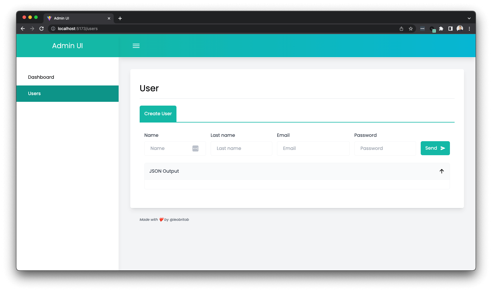

# Admin UI

A beautiful admin UI for React projects built using Vite.

[](https://choosealicense.com/licenses/mit/)



## Requeriments for installation

- Bash Terminal
- Node.js v16 or above
- npm v8 or above

## Before install

1. Copy the `.env.example` file to a new file named `.env`, and fill all the values correctly, to run locally it should be the same as the example file.

## Installation

```bash
# install all project's dependencies
npm install

# run the development server
npm run dev
```

## Roadmap

- [ ] Create more form inputs
- [ ] Charts
- [ ] Responsive

## Authors

- [@leobritob](https://www.github.com/leobritob)

## Support

Please, feel free to make this project better, just open a PR. If you have any questions, contact me using the email on my profile.
